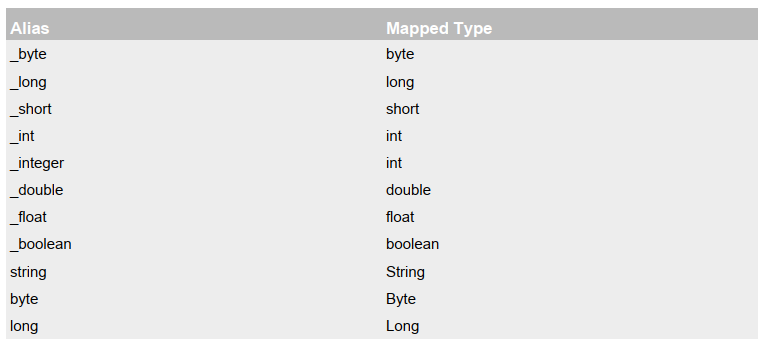
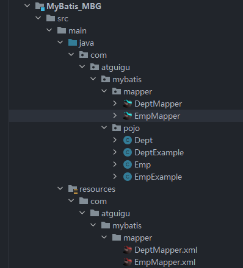
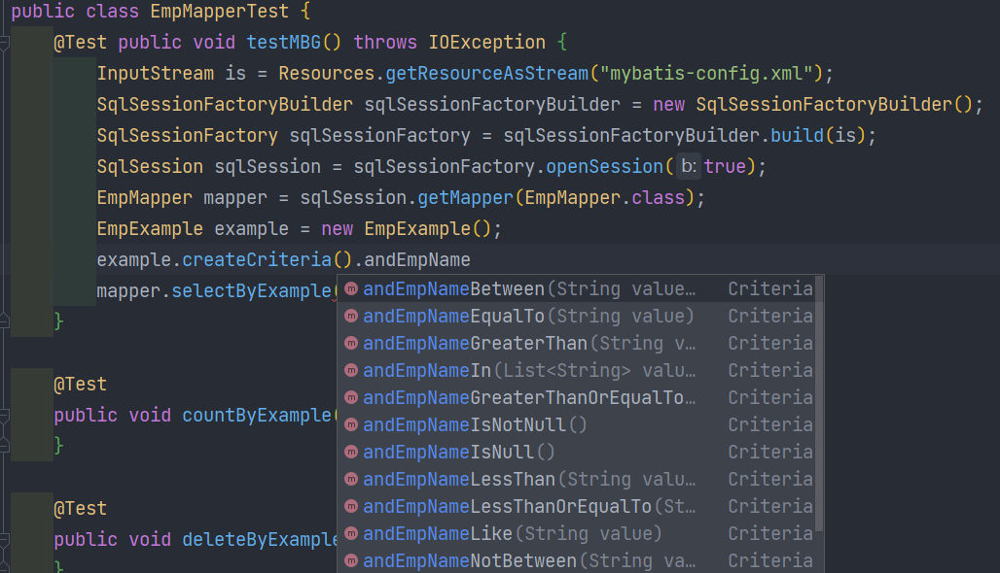
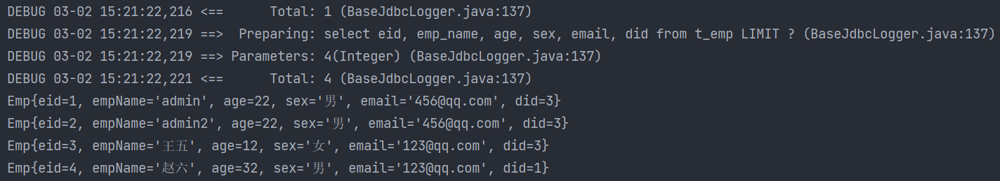

# MyBatis簡介 

## [課程影片](https://www.bilibili.com/video/BV1VP4y1c7j7/?p=1)

## MyBatis歷史
- MyBatis最初是Apache的一個開源項目iBatis, 2010年6月這個項目由Apache Software Foundation遷移到了Google Code。隨著開發團隊轉投Google Code旗下，iBatis3.x正式更名為MyBatis。代碼於2013年11月遷移到Github
- iBatis一詞來源於“internet”和“abatis”的組合，是一個基於Java的持久層框架。iBatis提供的持久層框架包括SQL Maps和Data Access Objects（DAO）
## MyBatis特性
1. MyBatis 是支持定制化SQL、存儲過程以及高級映射的優秀的持久層框架
2. MyBatis 避免了幾乎所有的JDBC 代碼和手動設置參數以及獲取結果集
3. MyBatis可以使用簡單的XML或註解用於配置和原始映射，將接口和Java的POJO（Plain Old Java Objects，普通的Java對象）映射成數據庫中的記錄
4. MyBatis 是一個半自動的ORM（Object Relation Mapping）框架
## MyBatis下載
- [MyBatis下載地址](https://github.com/mybatis/mybatis-3)
- 
## 和其它持久化層技術對比
- JDBC  
	- SQL 夾雜在Java代碼中耦合度高，導致硬編碼內傷  
	- 維護不易且實際開發需求中SQL 有變化，頻繁修改的情況多見  
	- 代碼冗長，開發效率低
- Hibernate 和JPA
	- 操作簡便，開發效率高  
	- 程序中的長難復雜SQL 需要繞過框架  
	- 內部自動生產的SQL，不容易做特殊優化  
	- 基於全映射的全自動框架，大量字段的POJO 進行部分映射時比較困難。  
	- 反射操作太多，導致數據庫性能下降
- MyBatis
	- 輕量級，性能出色  
	- SQL 和Java 編碼分開，功能邊界清晰。Java代碼專注業務、SQL語句專注數據  
	- 開發效率稍遜於HIbernate，但是完全能夠接受
# 搭建MyBatis
## 開發環境
- IDE：idea 2019.2  
- 構建工具：maven 3.5.4  
- MySQL版本：MySQL 5.7  
- MyBatis版本：MyBatis 3.5.7
## 創建maven工程
- 打包方式：jar
- 引入依賴
	```xml
	<dependencies>
		<!-- Mybatis核心-->
		<dependency>
			<groupId>org.mybatis</groupId>
			<artifactId>mybatis</artifactId>
			<version>3.5.7</version>
		</dependency>
		<!-- junit測試-->
		<dependency>
			<groupId>junit</groupId>
			<artifactId>junit</artifactId>
			<version>4.12</version>
			<scope>test</scope>
		</dependency>
		<!-- MySQL驅動-->
		<dependency>
			<groupId>mysql</groupId>
			<artifactId>mysql-connector-java</artifactId>
			<version>5.1.3</version>
			</dependency>
	</dependencies>
	```
## 創建MyBatis的核心配置文件
>習慣上命名為`mybatis-config.xml`，這個文件名僅僅只是建議，並非強制要求。將來整合Spring之後，這個配置文件可以省略，所以大家操作時可以直接複製、粘貼。
>核心配置文件主要用於配置連接數據庫的環境以及MyBatis的全局配置信息
>核心配置文件存放的位置是src/main/resources目錄下
```xml
<?xml version="1.0" encoding="UTF-8" ?>  
<!DOCTYPE configuration  
PUBLIC "-//mybatis.org//DTD Config 3.0//EN"  
"http://mybatis.org/dtd/mybatis-3-config.dtd">  
<configuration>  
	<!--設置連接數據庫的環境-->  
	<environments default="development">  
		<environment id="development">  
			<transactionManager type="JDBC"/>  
			<dataSource type="POOLED">  
				<property name="driver" value="com.mysql.cj.jdbc.Driver"/>  
				<property name="url" value="jdbc:mysql://localhost:3306/MyBatis"/>  
				<property name="username" value="root"/>  
				<property name="password" value="123456"/>  
			</dataSource>  
		</environment>  
	</environments>  
	<!--引入映射文件-->  
	<mappers>  
		<mapper resource="mappers/UserMapper.xml"/>  
	</mappers>  
</configuration>
```
## 創建mapper接口
>MyBatis中的mapper接口相當於以前的dao。但是區別在於，mapper僅僅是接口，我們不需要提供實現類
```java
package com.atguigu.mybatis.mapper;  
  
public interface UserMapper {  
	/**  
	* 添加用戶信息  
	*/  
	int insertUser();  
}
```
## 創建MyBatis的映射文件
- 相關概念：ORM（Object Relationship Mapping）對象關係映射。  
	- 對象：Java的實體類對象  
	- 關係：關係型數據庫  
	- 映射：二者之間的對應關係

| Java概念| 數據庫概念 |
| --- | --- |
| 類| 表 |
| 屬性| 字段/列 |
| 對象| 記錄/行 |

- 映射文件的命名規則
	- 表所對應的實體類的類名+Mapper.xml
	- 例如：表t_user，映射的實體類為User，所對應的映射文件為UserMapper.xml
	- 因此一個映射文件對應一個實體類，對應一張表的操作
	- MyBatis映射文件用於編寫SQL，訪問以及操作表中的數據
	- MyBatis映射文件存放的位置是src/main/resources/mappers目錄下
- MyBatis中可以面向接口操作數據，要保證兩個一致
	- mapper接口的全類名和映射文件的命名空間（namespace）保持一致
	- mapper接口中方法的方法名和映射文件中編寫SQL的標籤的id屬性保持一致
```xml
<?xml version="1.0" encoding="UTF-8" ?>  
<!DOCTYPE mapper  
PUBLIC "-//mybatis.org//DTD Mapper 3.0//EN"  
"http://mybatis.org/dtd/mybatis-3-mapper.dtd">  
<mapper namespace="com.atguigu.mybatis.mapper.UserMapper">  
	<!--int insertUser();-->  
	<insert id="insertUser">  
		insert into t_user values(null,'張三','123',23,'女')  
	</insert>  
</mapper>
```
## 通過junit測試功能
- SqlSession：代表Java程序和數據庫之間的會話。（HttpSession是Java程序和瀏覽器之間的會話）
- SqlSessionFactory：是“生產”SqlSession的“工廠”
- 工廠模式：如果創建某一個對象，使用的過程基本固定，那麼我們就可以把創建這個對象的相關代碼封裝到一個“工廠類”中，以後都使用這個工廠類來“生產”我們需要的對象
```java
public class UserMapperTest {
    @Test
    public void testInsertUser() throws IOException {
        //讀取MyBatis的核心配置文件
        InputStream is = Resources.getResourceAsStream("mybatis-config.xml");
        //獲取SqlSessionFactoryBuilder對象
        SqlSessionFactoryBuilder sqlSessionFactoryBuilder = new SqlSessionFactoryBuilder();
        //通過核心配置文件所對應的字節輸入流創建工廠類SqlSessionFactory，生產SqlSession對象
        SqlSessionFactory sqlSessionFactory = sqlSessionFactoryBuilder.build(is);
        //獲取sqlSession，此時通過SqlSession對象所操作的sql都必須手動提交或回滾事務
        //SqlSession sqlSession = sqlSessionFactory.openSession();
	    //創建SqlSession對象，此時通過SqlSession對象所操作的sql都會自動提交  
		SqlSession sqlSession = sqlSessionFactory.openSession(true);
        //通過代理模式創建UserMapper接口的代理實現類對象
        UserMapper userMapper = sqlSession.getMapper(UserMapper.class);
        //調用UserMapper接口中的方法，就可以根據UserMapper的全類名匹配元素文件，通過調用的方法名匹配映射文件中的SQL標籤，並執行標籤中的SQL語句
        int result = userMapper.insertUser();
        //提交事務
        //sqlSession.commit();
        System.out.println("result:" + result);
    }
}
```
- 此時需要手動提交事務，如果要自動提交事務，則在獲取sqlSession對象時，使用`SqlSession sqlSession = sqlSessionFactory.openSession(true);`，傳入一個Boolean類型的參數，值為true，這樣就可以自動提交
## 加入log4j日誌功能
1. 加入依賴
	```xml
	<!-- log4j日誌-->
	<dependency>
	<groupId>log4j</groupId>
	<artifactId>log4j</artifactId>
	<version>1.2.17</version>
	</dependency>
	```
2. 加入log4j的配置文件
	- log4j的配置文件名為log4j.xml，存放的位置是src/main/resources目錄下
	- 日誌的級別：FATAL(致命)>ERROR(錯誤)>WARN(警告)>INFO(信息)>DEBUG(調試) 從左到右打印的內容越來越詳細
	```xml
	<?xml version="1.0" encoding="UTF-8" ?>
	<!DOCTYPE log4j:configuration SYSTEM "log4j.dtd">
	<log4j:configuration xmlns:log4j="http://jakarta.apache.org/log4j/">
	    <appender name="STDOUT" class="org.apache.log4j.ConsoleAppender">
	        <param name="Encoding" value="UTF-8" />
	        <layout class="org.apache.log4j.PatternLayout">
				<param name="ConversionPattern" value="%-5p %d{MM-dd HH:mm:ss,SSS} %m (%F:%L) \n" />
	        </layout>
	    </appender>
	    <logger name="java.sql">
	        <level value="debug" />
	    </logger>
	    <logger name="org.apache.ibatis">
	        <level value="info" />
	    </logger>
	    <root>
	        <level value="debug" />
	        <appender-ref ref="STDOUT" />
	    </root>
	</log4j:configuration>
	```
# 核心配置文件詳解
>核心配置文件中的標籤必須按照固定的順序(有的標籤可以不寫，但順序一定不能亂)：
properties、settings、typeAliases、typeHandlers、objectFactory、objectWrapperFactory、reflectorFactory、plugins、environments、databaseIdProvider、mappers
```xml
<?xml version="1.0" encoding="UTF-8" ?>
<!DOCTYPE configuration
        PUBLIC "-//MyBatis.org//DTD Config 3.0//EN"
        "http://MyBatis.org/dtd/MyBatis-3-config.dtd">
<configuration>
    <!--引入properties文件，此時就可以${屬性名}的方式訪問屬性值-->
    <properties resource="jdbc.properties"></properties>
    <settings>
        <!--將表中字段的下劃線自動轉換為駝峰-->
        <setting name="mapUnderscoreToCamelCase" value="true"/>
        <!--開啟延遲加載-->
        <setting name="lazyLoadingEnabled" value="true"/>
    </settings>
    <typeAliases>
        <!--
        typeAlias：設置某個具體的類型的別名
        屬性：
        type：需要設置別名的類型的全類名
        alias：設置此類型的別名，且別名不區分大小寫。若不設置此屬性，該類型擁有默認的別名，即類名
        -->
        <!--<typeAlias type="com.atguigu.mybatis.bean.User"></typeAlias>-->
        <!--<typeAlias type="com.atguigu.mybatis.bean.User" alias="user">
        </typeAlias>-->
        <!--以包為單位，設置改包下所有的類型都擁有默認的別名，即類名且不區分大小寫-->
        <package name="com.atguigu.mybatis.bean"/>
    </typeAliases>
    <!--
    environments：設置多個連接數據庫的環境
    屬性：
	    default：設置默認使用的環境的id
    -->
    <environments default="mysql_test">
        <!--
        environment：設置具體的連接數據庫的環境信息
        屬性：
	        id：設置環境的唯一標識，可通過environments標籤中的default設置某一個環境的id，表示默認使用的環境
        -->
        <environment id="mysql_test">
            <!--
            transactionManager：設置事務管理方式
            屬性：
	            type：設置事務管理方式，type="JDBC|MANAGED"
	            type="JDBC"：設置當前環境的事務管理都必須手動處理
	            type="MANAGED"：設置事務被管理，例如spring中的AOP
            -->
            <transactionManager type="JDBC"/>
            <!--
            dataSource：設置數據源
            屬性：
	            type：設置數據源的類型，type="POOLED|UNPOOLED|JNDI"
	            type="POOLED"：使用數據庫連接池，即會將創建的連接進行緩存，下次使用可以從緩存中直接獲取，不需要重新創建
	            type="UNPOOLED"：不使用數據庫連接池，即每次使用連接都需要重新創建
	            type="JNDI"：調用上下文中的數據源
            -->
            <dataSource type="POOLED">
                <!--設置驅動類的全類名-->
                <property name="driver" value="${jdbc.driver}"/>
                <!--設置連接數據庫的連接地址-->
                <property name="url" value="${jdbc.url}"/>
                <!--設置連接數據庫的用戶名-->
                <property name="username" value="${jdbc.username}"/>
                <!--設置連接數據庫的密碼-->
                <property name="password" value="${jdbc.password}"/>
            </dataSource>
        </environment>
    </environments>
    <!--引入映射文件-->
    <mappers>
        <!-- <mapper resource="UserMapper.xml"/> -->
        <!--
        以包為單位，將包下所有的映射文件引入核心配置文件
        注意：
			1. 此方式必須保證mapper接口和mapper映射文件必須在相同的包下
			2. mapper接口要和mapper映射文件的名字一致
        -->
        <package name="com.atguigu.mybatis.mapper"/>
    </mappers>
</configuration>
```
- 
# 默認的類型別名


# MyBatis的增刪改查
1. 添加
	```xml
	<!--int insertUser();-->
	<insert id="insertUser">
		insert into t_user values(null,'admin','123456',23,'男','12345@qq.com')
	</insert>
	```
2. 刪除
	```xml
	<!--int deleteUser();-->
    <delete id="deleteUser">
        delete from t_user where id = 6
    </delete>
	```
3. 修改
	```xml
	<!--int updateUser();-->
    <update id="updateUser">
        update t_user set username = '張三' where id = 5
    </update>
	```
4. 查詢一個實體類對象
	```xml
   <!--User getUserById();-->  
	<select id="getUserById" resultType="com.atguigu.mybatis.bean.User">  
		select * from t_user where id = 2  
	</select>
	```
5. 查詢集合
	```xml
	<!--List<User> getUserList();-->
	<select id="getUserList" resultType="com.atguigu.mybatis.bean.User">
		select * from t_user
	</select>
	```
- 注意：
	1. 查詢的標籤select必須設置屬性resultType或resultMap，用於設置實體類和數據庫表的映射關係  
		- resultType：自動映射，用於屬性名和表中字段名一致的情況  
		- resultMap：自定義映射，用於一對多或多對一或字段名和屬性名不一致的情況  
	2. 當查詢的數據為多條時，不能使用實體類作為返回值，只能使用集合，否則會拋出異常TooManyResultsException；但是若查詢的數據只有一條，可以使用實體類或集合作為返回值
# MyBatis獲取參數值的兩種方式（重點）
- MyBatis獲取參數值的兩種方式：${}和#{}  
- ${}的本質就是字符串拼接，#{}的本質就是佔位符賦值  
- ${}使用字符串拼接的方式拼接sql，若為字符串類型或日期類型的字段進行賦值時，需要手動加單引號；但是#{}使用佔位符賦值的方式拼接sql，此時為字符串類型或日期類型的字段進行賦值時，可以自動添加單引號
## 單個字面量類型的參數
- 若mapper接口中的方法參數為單個的字面量類型，此時可以使用\${}和#{}以任意的名稱（最好見名識意）獲取參數的值，注意${}需要手動加單引號
```xml
<!--User getUserByUsername(String username);-->
<select id="getUserByUsername" resultType="User">
	select * from t_user where username = #{username}
</select>
```
```xml
<!--User getUserByUsername(String username);-->
<select id="getUserByUsername" resultType="User">  
	select * from t_user where username = '${username}'  
</select>
```
## 多個字面量類型的參數
- 若mapper接口中的方法參數為多個時，此時MyBatis會自動將這些參數放在一個map集合中
	1. 以arg0,arg1...為鍵，以參數為值；
	2. 以param1,param2...為鍵，以參數為值；
- 因此只需要通過\${}和#{}訪問map集合的鍵就可以獲取相對應的值，注意${}需要手動加單引號。
- 使用arg或者param都行，要注意的是，arg是從arg0開始的，param是從param1開始的
```xml
<!--User checkLogin(String username,String password);-->
<select id="checkLogin" resultType="User">  
	select * from t_user where username = #{arg0} and password = #{arg1}  
</select>
```
```xml
<!--User checkLogin(String username,String password);-->
<select id="checkLogin" resultType="User">
	select * from t_user where username = '${param1}' and password = '${param2}'
</select>
```
## map集合類型的參數
- 若mapper接口中的方法需要的參數為多個時，此時可以手動創建map集合，將這些數據放在map中只需要通過\${}和#{}訪問map集合的鍵就可以獲取相對應的值，注意${}需要手動加單引號
```xml
<!--User checkLoginByMap(Map<String,Object> map);-->
<select id="checkLoginByMap" resultType="User">
	select * from t_user where username = #{username} and password = #{password}
</select>
```
```java
@Test
public void checkLoginByMap() {
	SqlSession sqlSession = SqlSessionUtils.getSqlSession();
	ParameterMapper mapper = sqlSession.getMapper(ParameterMapper.class);
	Map<String,Object> map = new HashMap<>();
	map.put("usermane","admin");
	map.put("password","123456");
	User user = mapper.checkLoginByMap(map);
	System.out.println(user);
}
```
## 實體類類型的參數
- 若mapper接口中的方法參數為實體類對象時此時可以使用\${}和#{}，通過訪問實體類對像中的屬性名獲取屬性值，注意${}需要手動加單引號
```xml
<!--int insertUser(User user);-->
<insert id="insertUser">
	insert into t_user values(null,#{username},#{password},#{age},#{sex},#{email})
</insert>
```
```java
@Test
public void insertUser() {
	SqlSession sqlSession = SqlSessionUtils.getSqlSession();
	ParameterMapper mapper = sqlSession.getMapper(ParameterMapper.class);
	User user = new User(null,"Tom","123456",12,"男","123@321.com");
	mapper.insertUser(user);
}
```
## 使用@Param標識參數
- 可以通過@Param註解標識mapper接口中的方法參數，此時，會將這些參數放在map集合中
	1. 以@Param註解的value屬性值為鍵，以參數為值；
	2. 以param1,param2...為鍵，以參數為值；
- 只需要通過\${}和#{}訪問map集合的鍵就可以獲取相對應的值，注意${}需要手動加單引號
```xml
<!--User CheckLoginByParam(@Param("username") String username, @Param("password") String password);-->
    <select id="CheckLoginByParam" resultType="User">
        select * from t_user where username = #{username} and password = #{password}
    </select>
```
```java
@Test
public void checkLoginByParam() {
	SqlSession sqlSession = SqlSessionUtils.getSqlSession();
	ParameterMapper mapper = sqlSession.getMapper(ParameterMapper.class);
	mapper.CheckLoginByParam("admin","123456");
}
```
## 總結
- 建議分成兩種情況進行處理
	1. 實體類類型的參數
	2. 使用@Param標識參數
# MyBatis的各種查詢功能
1. 如果查詢出的數據只有一條，可以通過
	1. 實體類對象接收
	2. List集合接收
	3. Map集合接收，結果`{password=123456, sex=男, id=1, age=23, username=admin}`
2. 如果查詢出的數據有多條，一定不能用實體類對象接收，會拋異常TooManyResultsException，可以通過
	1. 實體類類型的LIst集合接收
	2. Map類型的LIst集合接收
	3. 在mapper接口的方法上添加@MapKey註解
## 查詢一個實體類對象
```java
/**
 * 根據用戶id查詢用戶信息
 * @param id
 * @return
 */
User getUserById(@Param("id") int id);
```
```xml
<!--User getUserById(@Param("id") int id);-->
<select id="getUserById" resultType="User">
	select * from t_user where id = #{id}
</select>
```
## 查詢一個List集合
```java
/**
 * 查詢所有用戶信息
 * @return
 */
List<User> getUserList();
```
```xml
<!--List<User> getUserList();-->
<select id="getUserList" resultType="User">
	select * from t_user
</select>
```
## 查詢單個數據
```java
/**  
 * 查詢用戶的總記錄數  
 * @return  
 * 在MyBatis中，對於Java中常用的類型都設置了類型別名  
 * 例如：java.lang.Integer-->int|integer  
 * 例如：int-->_int|_integer  
 * 例如：Map-->map,List-->list  
 */  
int getCount();
```
```xml
<!--int getCount();-->
<select id="getCount" resultType="_integer">
	select count(id) from t_user
</select>
```
## 查詢一條數據為map集合
```java
/**  
 * 根據用戶id查詢用戶信息為map集合  
 * @param id  
 * @return  
 */  
Map<String, Object> getUserToMap(@Param("id") int id);
```
```xml
<!--Map<String, Object> getUserToMap(@Param("id") int id);-->
<select id="getUserToMap" resultType="map">
	select * from t_user where id = #{id}
</select>
<!--結果：{password=123456, sex=男, id=1, age=23, username=admin}-->
```
## 查詢多條數據為map集合
### 方法一
```java
/**  
 * 查詢所有用戶信息為map集合  
 * @return  
 * 將表中的數據以map集合的方式查詢，一條數據對應一個map；若有多條數據，就會產生多個map集合，此時可以將這些map放在一個list集合中獲取  
 */  
List<Map<String, Object>> getAllUserToMap();
```
```xml
<!--Map<String, Object> getAllUserToMap();-->  
<select id="getAllUserToMap" resultType="map">  
	select * from t_user  
</select>
<!--
	結果：
	[{password=123456, sex=男, id=1, age=23, username=admin},
	{password=123456, sex=男, id=2, age=23, username=張三},
	{password=123456, sex=男, id=3, age=23, username=張三}]
-->
```
### 方法二
```java
/**
 * 查詢所有用戶信息為map集合
 * @return
 * 將表中的數據以map集合的方式查詢，一條數據對應一個map；若有多條數據，就會產生多個map集合，並且最終要以一個map的方式返回數據，此時需要通過@MapKey註解設置map集合的鍵，值是每條數據所對應的map集合
 */
@MapKey("id")
Map<String, Object> getAllUserToMap();
```
```xml
<!--Map<String, Object> getAllUserToMap();-->
<select id="getAllUserToMap" resultType="map">
	select * from t_user
</select>
<!--
	結果：
	{
	1={password=123456, sex=男, id=1, age=23, username=admin},
	2={password=123456, sex=男, id=2, age=23, username=張三},
	3={password=123456, sex=男, id=3, age=23, username=張三}
	}
-->
```
# 特殊SQL的執行
## 模糊查詢
```java
/**
 * 根據用戶名進行模糊查詢
 * @param username
 * @return java.util.List<com.atguigu.mybatis.pojo.User>
 * @date 2022/2/26 21:56
 */
List<User> getUserByLike(@Param("username") String username);
```
```xml
<!--List<User> getUserByLike(@Param("username") String username);-->
<select id="getUserByLike" resultType="User">
	<!--select * from t_user where username like '%${mohu}%'-->  
	<!--select * from t_user where username like concat('%',#{mohu},'%')-->  
	select * from t_user where username like "%"#{mohu}"%"
</select>
```
- 其中`select * from t_user where username like "%"#{mohu}"%"`是最常用的
## 批量刪除
- 只能使用\${}，如果使用#{}，則解析後的sql語句為`delete from t_user where id in ('1,2,3')`，這樣是將`1,2,3`看做是一個整體，只有id為`1,2,3`的數據會被刪除。正確的語句應該是`delete from t_user where id in (1,2,3)`，或者`delete from t_user where id in ('1','2','3')`
```java
/**
 * 根據id批量刪除
 * @param ids
 * @return int
 * @date 2022/2/26 22:06
 */
int deleteMore(@Param("ids") String ids);
```
```xml
<delete id="deleteMore">
	delete from t_user where id in (${ids})
</delete>
```
```java
//測試類
@Test
public void deleteMore() {
	SqlSession sqlSession = SqlSessionUtils.getSqlSession();
	SQLMapper mapper = sqlSession.getMapper(SQLMapper.class);
	int result = mapper.deleteMore("1,2,3,8");
	System.out.println(result);
}
```
## 動態設置表名
- 只能使用${}，因為表名不能加單引號
```java
/**
 * 查詢指定表中的數據
 * @param tableName
 * @return java.util.List<com.atguigu.mybatis.pojo.User>
 * @date 2022/2/27 14:41
 */
List<User> getUserByTable(@Param("tableName") String tableName);
```
```xml
<!--List<User> getUserByTable(@Param("tableName") String tableName);-->
<select id="getUserByTable" resultType="User">
	select * from ${tableName}
</select>
```
## 添加功能獲取自增的主鍵
- 使用場景
	- t_clazz(clazz_id,clazz_name)  
	- t_student(student_id,student_name,clazz_id)  
	1. 添加班級信息  
	2. 獲取新添加的班級的id  
	3. 為班級分配學生，即將某學的班級id修改為新添加的班級的id
- 在mapper.xml中設置兩個屬性
	- useGeneratedKeys：設置使用自增的主鍵  
	* keyProperty：因為增刪改有統一的返回值是受影響的行數，因此只能將獲取的自增的主鍵放在傳輸的參數user對象的某個屬性中
```java
/**
 * 添加用戶信息
 * @param user
 * @date 2022/2/27 15:04
 */
void insertUser(User user);
```
```xml
<!--void insertUser(User user);-->
<insert id="insertUser" useGeneratedKeys="true" keyProperty="id">
	insert into t_user values (null,#{username},#{password},#{age},#{sex},#{email})
</insert>
```
```java
//測試類
@Test
public void insertUser() {
	SqlSession sqlSession = SqlSessionUtils.getSqlSession();
	SQLMapper mapper = sqlSession.getMapper(SQLMapper.class);
	User user = new User(null, "ton", "123", 23, "男", "123@321.com");
	mapper.insertUser(user);
	System.out.println(user);
	//輸出：user{id=10, username='ton', password='123', age=23, sex='男', email='123@321.com'}，自增主鍵存放到了user的id屬性中
}
```
# 自定義映射resultMap
## resultMap處理字段和屬性的映射關係
- resultMap：設置自定義映射  
	- 屬性：  
		- id：表示自定義映射的唯一標識，不能重複
		- type：查詢的數據要映射的實體類的類型  
	- 子標籤：  
		- id：設置主鍵的映射關係  
		- result：設置普通字段的映射關係  
		- 子標籤屬性：  
			- property：設置映射關係中實體類中的屬性名  
			- column：設置映射關係中表中的字段名
- 若字段名和實體類中的屬性名不一致，則可以通過resultMap設置自定義映射，即使字段名和屬性名一致的屬性也要映射，也就是全部屬性都要列出來
```xml
<resultMap id="empResultMap" type="Emp">
	<id property="eid" column="eid"></id>
	<result property="empName" column="emp_name"></result>
	<result property="age" column="age"></result>
	<result property="sex" column="sex"></result>
	<result property="email" column="email"></result>
</resultMap>
<!--List<Emp> getAllEmp();-->
<select id="getAllEmp" resultMap="empResultMap">
	select * from t_emp
</select>
```
- 若字段名和實體類中的屬性名不一致，但是字段名符合數據庫的規則（使用_），實體類中的屬性名符合Java的規則（使用駝峰）。此時也可通過以下兩種方式處理字段名和實體類中的屬性的映射關係  
	1. 可以通過為字段起別名的方式，保證和實體類中的屬性名保持一致  
		```xml
		<!--List<Emp> getAllEmp();-->
		<select id="getAllEmp" resultType="Emp">
			select eid,emp_name empName,age,sex,email from t_emp
		</select>
		```
	2. 可以在MyBatis的核心配置文件中的`setting`標籤中，設置一個全局配置信息mapUnderscoreToCamelCase，可以在查詢表中數據時，自動將_類型的字段名轉換為駝峰，例如：字段名user_name，設置了mapUnderscoreToCamelCase，此時字段名就會轉換為userName。[核心配置文件詳解](#核心配置文件詳解)
		```xml
    <settings>
        <setting name="mapUnderscoreToCamelCase" value="true"/>
    </settings>
		```
## 多對一映射處理
>查詢員工信息以及員工所對應的部門信息
```java
public class Emp {  
	private Integer eid;  
	private String empName;  
	private Integer age;  
	private String sex;  
	private String email;  
	private Dept dept;
	//...構造器、get、set方法等
}
```
### 級聯方式處理映射關係
```xml
<resultMap id="empAndDeptResultMapOne" type="Emp">
	<id property="eid" column="eid"></id>
	<result property="empName" column="emp_name"></result>
	<result property="age" column="age"></result>
	<result property="sex" column="sex"></result>
	<result property="email" column="email"></result>
	<result property="dept.did" column="did"></result>
	<result property="dept.deptName" column="dept_name"></result>
</resultMap>
<!--Emp getEmpAndDept(@Param("eid")Integer eid);-->
<select id="getEmpAndDept" resultMap="empAndDeptResultMapOne">
	select * from t_emp left join t_dept on t_emp.eid = t_dept.did where t_emp.eid = #{eid}
</select>
```
### 使用association處理映射關係
- association：處理多對一的映射關係
- property：需要處理多對的映射關係的屬性名
- javaType：該屬性的類型
```xml
<resultMap id="empAndDeptResultMapTwo" type="Emp">
	<id property="eid" column="eid"></id>
	<result property="empName" column="emp_name"></result>
	<result property="age" column="age"></result>
	<result property="sex" column="sex"></result>
	<result property="email" column="email"></result>
	<association property="dept" javaType="Dept">
		<id property="did" column="did"></id>
		<result property="deptName" column="dept_name"></result>
	</association>
</resultMap>
<!--Emp getEmpAndDept(@Param("eid")Integer eid);-->
<select id="getEmpAndDept" resultMap="empAndDeptResultMapTwo">
	select * from t_emp left join t_dept on t_emp.eid = t_dept.did where t_emp.eid = #{eid}
</select>
```
### 分步查詢
#### 1. 查詢員工信息
- select：設置分佈查詢的sql的唯一標識（namespace.SQLId或mapper接口的全類名.方法名）
- column：設置分步查詢的條件
```java
//EmpMapper裡的方法
/**
 * 通過分步查詢，員工及所對應的部門信息
 * 分步查詢第一步：查詢員工信息
 * @param  
 * @return com.atguigu.mybatis.pojo.Emp
 * @date 2022/2/27 20:17
 */
Emp getEmpAndDeptByStepOne(@Param("eid") Integer eid);
```
```xml
<resultMap id="empAndDeptByStepResultMap" type="Emp">
	<id property="eid" column="eid"></id>
	<result property="empName" column="emp_name"></result>
	<result property="age" column="age"></result>
	<result property="sex" column="sex"></result>
	<result property="email" column="email"></result>
	<association property="dept"
				 select="com.atguigu.mybatis.mapper.DeptMapper.getEmpAndDeptByStepTwo"
				 column="did"></association>
</resultMap>
<!--Emp getEmpAndDeptByStepOne(@Param("eid") Integer eid);-->
<select id="getEmpAndDeptByStepOne" resultMap="empAndDeptByStepResultMap">
	select * from t_emp where eid = #{eid}
</select>
```
#### 2. 查詢部門信息
```java
//DeptMapper裡的方法
/**
 * 通過分步查詢，員工及所對應的部門信息
 * 分步查詢第二步：通過did查詢員工對應的部門信息
 * @param
 * @return com.atguigu.mybatis.pojo.Emp
 * @date 2022/2/27 20:23
 */
Dept getEmpAndDeptByStepTwo(@Param("did") Integer did);
```
```xml
<!--此處的resultMap僅是處理字段和屬性的映射關係-->
<resultMap id="EmpAndDeptByStepTwoResultMap" type="Dept">
	<id property="did" column="did"></id>
	<result property="deptName" column="dept_name"></result>
</resultMap>
<!--Dept getEmpAndDeptByStepTwo(@Param("did") Integer did);-->
<select id="getEmpAndDeptByStepTwo" resultMap="EmpAndDeptByStepTwoResultMap">
	select * from t_dept where did = #{did}
</select>
```
## 一對多映射處理
```java
public class Dept {
    private Integer did;
    private String deptName;
    private List<Emp> emps;
	//...構造器、get、set方法等
}
```
### collection
- collection：用來處理一對多的映射關係
- ofType：表示該屬性對飲的集合中存儲的數據的類型
```xml
<resultMap id="DeptAndEmpResultMap" type="Dept">
	<id property="did" column="did"></id>
	<result property="deptName" column="dept_name"></result>
	<collection property="emps" ofType="Emp">
		<id property="eid" column="eid"></id>
		<result property="empName" column="emp_name"></result>
		<result property="age" column="age"></result>
		<result property="sex" column="sex"></result>
		<result property="email" column="email"></result>
	</collection>
</resultMap>
<!--Dept getDeptAndEmp(@Param("did") Integer did);-->
<select id="getDeptAndEmp" resultMap="DeptAndEmpResultMap">
	select * from t_dept left join t_emp on t_dept.did = t_emp.did where t_dept.did = #{did}
</select>
```
### 分步查詢
#### 1. 查詢部門信息
```java
/**
 * 通過分步查詢，查詢部門及對應的所有員工信息
 * 分步查詢第一步：查詢部門信息
 * @param did
 * @return com.atguigu.mybatis.pojo.Dept
 * @date 2022/2/27 22:04
 */
Dept getDeptAndEmpByStepOne(@Param("did") Integer did);
```
```xml
<resultMap id="DeptAndEmpByStepOneResultMap" type="Dept">
	<id property="did" column="did"></id>
	<result property="deptName" column="dept_name"></result>
	<collection property="emps"
				select="com.atguigu.mybatis.mapper.EmpMapper.getDeptAndEmpByStepTwo"
				column="did"></collection>
</resultMap>
<!--Dept getDeptAndEmpByStepOne(@Param("did") Integer did);-->
<select id="getDeptAndEmpByStepOne" resultMap="DeptAndEmpByStepOneResultMap">
	select * from t_dept where did = #{did}
</select>
```
#### 2. 根據部門id查詢部門中的所有員工
```java
/**
 * 通過分步查詢，查詢部門及對應的所有員工信息
 * 分步查詢第二步：根據部門id查詢部門中的所有員工
 * @param did
 * @return java.util.List<com.atguigu.mybatis.pojo.Emp>
 * @date 2022/2/27 22:10
 */
List<Emp> getDeptAndEmpByStepTwo(@Param("did") Integer did);
```
```xml
<!--List<Emp> getDeptAndEmpByStepTwo(@Param("did") Integer did);-->
<select id="getDeptAndEmpByStepTwo" resultType="Emp">
	select * from t_emp where did = #{did}
</select>
```
## 延遲加載
- 分步查詢的優點：可以實現延遲加載，但是必須在核心配置文件中設置全局配置信息：
	- lazyLoadingEnabled：延遲加載的全局開關。當開啟時，所有關聯對像都會延遲加載  
	- aggressiveLazyLoading：當開啟時，任何方法的調用都會加載該對象的所有屬性。否則，每個屬性會按需加載  
- 此時就可以實現按需加載，獲取的數據是什麼，就只會執行相應的sql。此時可通過association和collection中的fetchType屬性設置當前的分步查詢是否使用延遲加載，fetchType="lazy(延遲加載)|eager(立即加載)"
```xml
<settings>
	<!--開啟延遲加載-->
	<setting name="lazyLoadingEnabled" value="true"/>
</settings>
```

```java
@Test
public void getEmpAndDeptByStepOne() {
	SqlSession sqlSession = SqlSessionUtils.getSqlSession();
	EmpMapper mapper = sqlSession.getMapper(EmpMapper.class);
	Emp emp = mapper.getEmpAndDeptByStepOne(1);
	System.out.println(emp.getEmpName());
}
```
- 關閉延遲加載，兩條SQL語句都運行了
- 開啟延遲加載，只運行獲取emp的SQL語句

```java
@Test
public void getEmpAndDeptByStepOne() {
	SqlSession sqlSession = SqlSessionUtils.getSqlSession();
	EmpMapper mapper = sqlSession.getMapper(EmpMapper.class);
	Emp emp = mapper.getEmpAndDeptByStepOne(1);
	System.out.println(emp.getEmpName());
	System.out.println("----------------");
	System.out.println(emp.getDept());
}
```
- 開啟後，需要用到查詢dept的時候才會調用相應的SQL語句
- fetchType：當開啟了全局的延遲加載之後，可以通過該屬性手動控制延遲加載的效果，fetchType="lazy(延遲加載)|eager(立即加載)"
	```xml
	<resultMap id="empAndDeptByStepResultMap" type="Emp">
		<id property="eid" column="eid"></id>
		<result property="empName" column="emp_name"></result>
		<result property="age" column="age"></result>
		<result property="sex" column="sex"></result>
		<result property="email" column="email"></result>
		<association property="dept"
					 select="com.atguigu.mybatis.mapper.DeptMapper.getEmpAndDeptByStepTwo"
					 column="did"
					 fetchType="lazy"></association>
	</resultMap>
	```
# 動態SQL
- Mybatis框架的動態SQL技術是一種根據特定條件動態拼裝SQL語句的功能，它存在的意義是為了解決拼接SQL語句字符串時的痛點問題
## if
- if標籤可通過test屬性（即傳遞過來的數據）的表達式進行判斷，若表達式的結果為true，則標籤中的內容會執行；反之標籤中的內容不會執行
- 在where後面添加一個恆成立條件`1=1`
	- 這個恆成立條件並不會影響查詢的結果
	- 這個`1=1`可以用來拼接`and`語句，例如：當empName為null時
		- 如果不加上恆成立條件，則SQL語句為`select * from t_emp where and age = ? and sex = ? and email = ?`，此時`where`會與`and`連用，SQL語句會報錯
		- 如果加上一個恆成立條件，則SQL語句為`select * from t_emp where 1= 1 and age = ? and sex = ? and email = ?`，此時不報錯
```xml
<!--List<Emp> getEmpByCondition(Emp emp);-->
<select id="getEmpByCondition" resultType="Emp">
	select * from t_emp where 1=1
	<if test="empName != null and empName !=''">
		and emp_name = #{empName}
	</if>
	<if test="age != null and age !=''">
		and age = #{age}
	</if>
	<if test="sex != null and sex !=''">
		and sex = #{sex}
	</if>
	<if test="email != null and email !=''">
		and email = #{email}
	</if>
</select>
```
## where
- where和if一般結合使用：
	- 若where標籤中的if條件都不滿足，則where標籤沒有任何功能，即不會添加where關鍵字  
	- 若where標籤中的if條件滿足，則where標籤會自動添加where關鍵字，並將條件最前方多餘的and/or去掉  
```xml
<!--List<Emp> getEmpByCondition(Emp emp);-->
<select id="getEmpByCondition" resultType="Emp">
	select * from t_emp
	<where>
		<if test="empName != null and empName !=''">
			emp_name = #{empName}
		</if>
		<if test="age != null and age !=''">
			and age = #{age}
		</if>
		<if test="sex != null and sex !=''">
			and sex = #{sex}
		</if>
		<if test="email != null and email !=''">
			and email = #{email}
		</if>
	</where>
</select>
```
- 注意：where標籤不能去掉條件後多餘的and/or
	```xml
	<!--這種用法是錯誤的，只能去掉條件前面的and/or，條件後面的不行-->
	<if test="empName != null and empName !=''">
	emp_name = #{empName} and
	</if>
	<if test="age != null and age !=''">
		age = #{age}
	</if>
	```
## trim
- trim用於去掉或添加標籤中的內容  
- 常用屬性
	- prefix：在trim標籤中的內容的前面添加某些內容  
	- suffix：在trim標籤中的內容的後面添加某些內容
	- prefixOverrides：在trim標籤中的內容的前面去掉某些內容  
	- suffixOverrides：在trim標籤中的內容的後面去掉某些內容
- 若trim中的標籤都不滿足條件，則trim標籤沒有任何效果，也就是只剩下`select * from t_emp`
```xml
<!--List<Emp> getEmpByCondition(Emp emp);-->
<select id="getEmpByCondition" resultType="Emp">
	select * from t_emp
	<trim prefix="where" suffixOverrides="and|or">
		<if test="empName != null and empName !=''">
			emp_name = #{empName} and
		</if>
		<if test="age != null and age !=''">
			age = #{age} and
		</if>
		<if test="sex != null and sex !=''">
			sex = #{sex} or
		</if>
		<if test="email != null and email !=''">
			email = #{email}
		</if>
	</trim>
</select>
```
```java
//測試類
@Test
public void getEmpByCondition() {
	SqlSession sqlSession = SqlSessionUtils.getSqlSession();
	DynamicSQLMapper mapper = sqlSession.getMapper(DynamicSQLMapper.class);
	List<Emp> emps= mapper.getEmpByCondition(new Emp(null, "張三", null, null, null, null));
	System.out.println(emps);
}
```

## choose、when、otherwise
- `choose、when、otherwise`相當於`if...else if..else`
- when至少要有一個，otherwise至多只有一個
```xml
<select id="getEmpByChoose" resultType="Emp">
	select * from t_emp
	<where>
		<choose>
			<when test="empName != null and empName != ''">
				emp_name = #{empName}
			</when>
			<when test="age != null and age != ''">
				age = #{age}
			</when>
			<when test="sex != null and sex != ''">
				sex = #{sex}
			</when>
			<when test="email != null and email != ''">
				email = #{email}
			</when>
			<otherwise>
				did = 1
			</otherwise>
		</choose>
	</where>
</select>
```
```java
@Test
public void getEmpByChoose() {
	SqlSession sqlSession = SqlSessionUtils.getSqlSession();
	DynamicSQLMapper mapper = sqlSession.getMapper(DynamicSQLMapper.class);
	List<Emp> emps = mapper.getEmpByChoose(new Emp(null, "張三", 23, "男", "123@qq.com", null));
	System.out.println(emps);
}
```

- 相當於`if a else if b else if c else d`，只會執行其中一個
## foreach
- 屬性：  
	- collection：設置要循環的數組或集合  
	- item：表示集合或數組中的每一個數據  
	- separator：設置循環體之間的分隔符，分隔符前後默認有一個空格，如` , `
	- open：設置foreach標籤中的內容的開始符  
	- close：設置foreach標籤中的內容的結束符
- 批量刪除
	```xml
	<!--int deleteMoreByArray(Integer[] eids);-->
	<delete id="deleteMoreByArray">
		delete from t_emp where eid in
		<foreach collection="eids" item="eid" separator="," open="(" close=")">
			#{eid}
		</foreach>
	</delete>
	```
	```java
	@Test
	public void deleteMoreByArray() {
		SqlSession sqlSession = SqlSessionUtils.getSqlSession();
		DynamicSQLMapper mapper = sqlSession.getMapper(DynamicSQLMapper.class);
		int result = mapper.deleteMoreByArray(new Integer[]{6, 7, 8, 9});
		System.out.println(result);
	}
	```
	
- 批量添加
	```xml
	<!--int insertMoreByList(@Param("emps") List<Emp> emps);-->
	<insert id="insertMoreByList">
		insert into t_emp values
		<foreach collection="emps" item="emp" separator=",">
			(null,#{emp.empName},#{emp.age},#{emp.sex},#{emp.email},null)
		</foreach>
	</insert>
	```
	```java
	@Test
	public void insertMoreByList() {
		SqlSession sqlSession = SqlSessionUtils.getSqlSession();
		DynamicSQLMapper mapper = sqlSession.getMapper(DynamicSQLMapper.class);
		Emp emp1 = new Emp(null,"a",1,"男","123@321.com",null);
		Emp emp2 = new Emp(null,"b",1,"男","123@321.com",null);
		Emp emp3 = new Emp(null,"c",1,"男","123@321.com",null);
		List<Emp> emps = Arrays.asList(emp1, emp2, emp3);
		int result = mapper.insertMoreByList(emps);
		System.out.println(result);
	}
	```
	
## SQL片段
- sql片段，可以記錄一段公共sql片段，在使用的地方通過include標籤進行引入
- 聲明sql片段：`<sql>`標籤
```xml
<sql id="empColumns">eid,emp_name,age,sex,email</sql>
```
- 引用sql片段：`<include>`標籤
```xml
<!--List<Emp> getEmpByCondition(Emp emp);-->
<select id="getEmpByCondition" resultType="Emp">
	select <include refid="empColumns"></include> from t_emp
</select>
```
# MyBatis的緩存
## MyBatis的一級緩存
- 一級緩存是SqlSession級別的，通過同一個SqlSession查詢的數據會被緩存，下次查詢相同的數據，就會從緩存中直接獲取，不會從數據庫重新訪問  
- 使一級緩存失效的四種情況：  
	1. 不同的SqlSession對應不同的一級緩存  
	2. 同一個SqlSession但是查詢條件不同
	3. 同一個SqlSession兩次查詢期間執行了任何一次增刪改操作
	4. 同一個SqlSession兩次查詢期間手動清空了緩存
## MyBatis的二級緩存
- 二級緩存是SqlSessionFactory級別，通過同一個SqlSessionFactory創建的SqlSession查詢的結果會被緩存；此後若再次執行相同的查詢語句，結果就會從緩存中獲取  
- 二級緩存開啟的條件
	1. 在核心配置文件中，設置全局配置屬性cacheEnabled="true"，默認為true，不需要設置
	2. 在映射文件中設置標籤<cache />
	3. 二級緩存必須在SqlSession關閉或提交之後有效
	4. 查詢的數據所轉換的實體類類型必須實現序列化的接口
- 使二級緩存失效的情況：兩次查詢之間執行了任意的增刪改，會使一級和二級緩存同時失效
## 二級緩存的相關配置
- 在mapper配置文件中添加的cache標籤可以設置一些屬性
- eviction屬性：緩存回收策略  
	- LRU（Least Recently Used） – 最近最少使用的：移除最長時間不被使用的對象。  
	- FIFO（First in First out） – 先進先出：按對象進入緩存的順序來移除它們。  
	- SOFT – 軟引用：移除基於垃圾回收器狀態和軟引用規則的對象。  
	- WEAK – 弱引用：更積極地移除基於垃圾收集器狀態和弱引用規則的對象。
	- 默認的是LRU
- flushInterval屬性：刷新間隔，單位毫秒
	- 默認情況是不設置，也就是沒有刷新間隔，緩存僅僅調用語句（增刪改）時刷新
- size屬性：引用數目，正整數
	- 代表緩存最多可以存儲多少個對象，太大容易導致內存溢出
- readOnly屬性：只讀，true/false
	- true：只讀緩存；會給所有調用者返回緩存對象的相同實例。因此這些對像不能被修改。這提供了很重要的性能優勢。  
	- false：讀寫緩存；會返回緩存對象的拷貝（通過序列化）。這會慢一些，但是安全，因此默認是false
## MyBatis緩存查詢的順序
- 先查詢二級緩存，因為二級緩存中可能會有其他程序已經查出來的數據，可以拿來直接使用  
- 如果二級緩存沒有命中，再查詢一級緩存  
- 如果一級緩存也沒有命中，則查詢數據庫  
- SqlSession關閉之後，一級緩存中的數據會寫入二級緩存
## 整合第三方緩存EHCache（了解）
### 添加依賴
```xml
<!-- Mybatis EHCache整合包-->
<dependency>
	<groupId>org.mybatis.caches</groupId>
	<artifactId>mybatis-ehcache</artifactId>
	<version>1.2.1</version>
</dependency>
<!-- slf4j日誌門面的一個具體實現-->
<dependency>
	<groupId>ch.qos.logback</groupId>
	<artifactId>logback-classic</artifactId>
	<version>1.2.3</version>
</dependency>
```
### 各個jar包的功能
| jar包名稱| 作用 |
| --- | --- |
| mybatis-ehcache | Mybatis和EHCache的整合包 |
| ehcache | EHCache核心包 |
| slf4j-api | SLF4J日誌門麵包 |
| logback-classic | 支持SLF4J門面接口的一個具體實現 |

### 創建EHCache的配置文件ehcache.xml
- 名字必須叫`ehcache.xml`
```xml
<?xml version="1.0" encoding="utf-8" ?>
<ehcache xmlns:xsi="http://www.w3.org/2001/XMLSchema-instance"
         xsi:noNamespaceSchemaLocation="../config/ehcache.xsd">
    <!-- 磁盤保存路徑-->
    <diskStore path="D:\atguigu\ehcache"/>
    <defaultCache
            maxElementsInMemory="1000"
            maxElementsOnDisk="10000000"
            eternal="false"
            overflowToDisk="true"
            timeToIdleSeconds="120"
            timeToLiveSeconds="120"
            diskExpiryThreadIntervalSeconds="120"
            memoryStoreEvictionPolicy="LRU">
    </defaultCache>
</ehcache>
```
### 設置二級緩存的類型
- 在xxxMapper.xml文件中設置二級緩存類型
```xml
<cache type="org.mybatis.caches.ehcache.EhcacheCache"/>
```
### 加入logback日誌
- 存在SLF4J時，作為簡易日誌的log4j將失效，此時我們需要藉助SLF4J的具體實現logback來打印日誌。創建logback的配置文件`logback.xml`，名字固定，不可改變
```xml
<?xml version="1.0" encoding="UTF-8"?>
<configuration debug="true">
    <!-- 指定日誌輸出的位置-->
    <appender name="STDOUT"
              class="ch.qos.logback.core.ConsoleAppender">
        <encoder>
            <!-- 日誌輸出的格式-->
            <!-- 按照順序分別是：時間、日誌級別、線程名稱、打印日誌的類、日誌主體內容、換行-->
            <pattern>[%d{HH:mm:ss.SSS}] [%-5level] [%thread] [%logger] [%msg]%n</pattern>
        </encoder>
    </appender>
    <!-- 設置全局日誌級別。日誌級別按順序分別是：DEBUG、INFO、WARN、ERROR -->
    <!-- 指定任何一個日誌級別都只打印當前級別和後面級別的日誌。-->
    <root level="DEBUG">
        <!-- 指定打印日誌的appender，這里通過“STDOUT”引用了前面配置的appender -->
        <appender-ref ref="STDOUT" />
    </root>
    <!-- 根據特殊需求指定局部日誌級別-->
    <logger name="com.atguigu.crowd.mapper" level="DEBUG"/>
</configuration>
```
### EHCache配置文件說明
| 屬性名| 是否必須| 作用 |
| --- | --- | --- |
| maxElementsInMemory | 是| 在內存中緩存的element的最大數目 |
| maxElementsOnDisk | 是| 在磁盤上緩存的element的最大數目，若是0表示無窮大 |
| eternal | 是| 設定緩存的elements是否永遠不過期。如果為true，則緩存的數據始終有效， 如果為false那麼還要根據timeToIdleSeconds、timeToLiveSeconds判斷 |
| overflowToDisk | 是| 設定當內存緩存溢出的時候是否將過期的element緩存到磁盤上 |
| timeToIdleSeconds | 否| 當緩存在EhCache中的數據前後兩次訪問的時間超過timeToIdleSeconds的屬性取值時， 這些數據便會刪除，默認值是0,也就是可閒置時間無窮大 |
| timeToLiveSeconds | 否| 緩存element的有效生命期，默認是0.,也就是element存活時間無窮大 |
| diskSpoolBufferSizeMB | 否| DiskStore(磁盤緩存)的緩存區大小。默認是30MB。每個Cache都應該有自己的一個緩衝區 |
| diskPersistent | 否| 在VM重啟的時候是否啟用磁盤保存EhCache中的數據，默認是false |
| diskExpiryThreadIntervalSeconds | 否| 磁盤緩存的清理線程運行間隔，默認是120秒。每個120s， 相應的線程會進行一次EhCache中數據的清理工作 |
| memoryStoreEvictionPolicy | 否| 當內存緩存達到最大，有新的element加入的時候， 移除緩存中element的策略。默認是LRU（最近最少使用），可選的有LFU（最不常使用）和FIFO（先進先出 |
# MyBatis的逆向工程
- 正向工程：先創建Java實體類，由框架負責根據實體類生成數據庫表。Hibernate是支持正向工程的
- 逆向工程：先創建數據庫表，由框架負責根據數據庫表，反向生成如下資源：  
	- Java實體類  
	- Mapper接口  
	- Mapper映射文件
## 創建逆向工程的步驟
### 添加依賴和插件
```xml
<dependencies>
	<!-- MyBatis核心依賴包-->
	<dependency>
		<groupId>org.mybatis</groupId>
		<artifactId>mybatis</artifactId>
		<version>3.5.9</version>
	</dependency>
	<!-- junit測試-->
	<dependency>
		<groupId>junit</groupId>
		<artifactId>junit</artifactId>
		<version>4.13.2</version>
		<scope>test</scope>
	</dependency>
	<!-- MySQL驅動-->
	<dependency>
		<groupId>mysql</groupId>
		<artifactId>mysql-connector-java</artifactId>
		<version>8.0.27</version>
	</dependency>
	<!-- log4j日誌-->
	<dependency>
		<groupId>log4j</groupId>
		<artifactId>log4j</artifactId>
		<version>1.2.17</version>
	</dependency>
</dependencies>
<!-- 控制Maven在構建過程中相關配置-->
<build>
	<!-- 構建過程中用到的插件-->
	<plugins>
		<!-- 具體插件，逆向工程的操作是以構建過程中插件形式出現的-->
		<plugin>
			<groupId>org.mybatis.generator</groupId>
			<artifactId>mybatis-generator-maven-plugin</artifactId>
			<version>1.3.0</version>
			<!-- 插件的依賴-->
			<dependencies>
				<!-- 逆向工程的核心依賴-->
				<dependency>
					<groupId>org.mybatis.generator</groupId>
					<artifactId>mybatis-generator-core</artifactId>
					<version>1.3.2</version>
				</dependency>
				<!-- 數據庫連接池-->
				<dependency>
					<groupId>com.mchange</groupId>
					<artifactId>c3p0</artifactId>
					<version>0.9.2</version>
				</dependency>
				<!-- MySQL驅動-->
				<dependency>
					<groupId>mysql</groupId>
					<artifactId>mysql-connector-java</artifactId>
					<version>8.0.27</version>
				</dependency>
			</dependencies>
		</plugin>
	</plugins>
</build>
```
### 創建MyBatis的核心配置文件
```xml
<?xml version="1.0" encoding="UTF-8" ?>
<!DOCTYPE configuration
        PUBLIC "-//mybatis.org//DTD Config 3.0//EN"
        "http://mybatis.org/dtd/mybatis-3-config.dtd">
<configuration>
    <properties resource="jdbc.properties"/>
    <typeAliases>
        <package name=""/>
    </typeAliases>
    <environments default="development">
        <environment id="development">
            <transactionManager type="JDBC"/>
            <dataSource type="POOLED">
                <property name="driver" value="${jdbc.driver}"/>
                <property name="url" value="${jdbc.url}"/>
                <property name="username" value="${jdbc.username}"/>
                <property name="password" value="${jdbc.password}"/>
            </dataSource>
        </environment>
    </environments>
    <mappers>
        <package name=""/>
    </mappers>
</configuration>
```
### 創建逆向工程的配置文件
- 文件名必須是：`generatorConfig.xml`
```xml
<?xml version="1.0" encoding="UTF-8"?>
<!DOCTYPE generatorConfiguration
        PUBLIC "-//mybatis.org//DTD MyBatis Generator Configuration 1.0//EN"
        "http://mybatis.org/dtd/mybatis-generator-config_1_0.dtd">
<generatorConfiguration>
    <!--
    targetRuntime: 執行生成的逆向工程的版本
    MyBatis3Simple: 生成基本的CRUD（清新簡潔版）
    MyBatis3: 生成帶條件的CRUD（奢華尊享版）
    -->
    <context id="DB2Tables" targetRuntime="MyBatis3Simple">
        <!-- 數據庫的連接信息-->
        <jdbcConnection driverClass="com.mysql.cj.jdbc.Driver"
                        connectionURL="jdbc:mysql://localhost:3306/mybatis"
                        userId="root"
                        password="123456">
        </jdbcConnection>
        <!-- javaBean的生成策略-->
        <javaModelGenerator targetPackage="com.atguigu.mybatis.pojo" targetProject=".\src\main\java">
            <property name="enableSubPackages" value="true" />
            <property name="trimStrings" value="true" />
        </javaModelGenerator>
        <!-- SQL映射文件的生成策略-->
        <sqlMapGenerator targetPackage="com.atguigu.mybatis.mapper"
                         targetProject=".\src\main\resources">
            <property name="enableSubPackages" value="true" />
        </sqlMapGenerator>
        <!-- Mapper接口的生成策略-->
        <javaClientGenerator type="XMLMAPPER"
                             targetPackage="com.atguigu.mybatis.mapper" targetProject=".\src\main\java">
            <property name="enableSubPackages" value="true" />
        </javaClientGenerator>
        <!-- 逆向分析的表-->
        <!-- tableName設置為*號，可以對應所有表，此時不寫domainObjectName -->
        <!-- domainObjectName屬性指定生成出來的實體類的類名-->
        <table tableName="t_emp" domainObjectName="Emp"/>
        <table tableName="t_dept" domainObjectName="Dept"/>
    </context>
</generatorConfiguration>
```
### 執行MBG插件的generate目標
- 
- 如果出現報錯：`Exception getting JDBC Driver`，可能是pom.xml中，數據庫驅動配置錯誤
	- dependency中的驅動
	- mybatis-generator-maven-plugin插件中的驅動
	- 兩者的驅動版本應該相同
- 執行結果
## QBC
### 查詢
- `selectByExample`：按條件查詢，需要傳入一個example對像或者null；如果傳入一個null，則表示沒有條件，也就是查詢所有數據
- `example.createCriteria().xxx`：創建條件對象，通過andXXX方法為SQL添加查詢添加，每個條件之間是and關係
- `example.or().xxx`：將之前添加的條件通過or拼接其他條件

```java
@Test public void testMBG() throws IOException {
	InputStream is = Resources.getResourceAsStream("mybatis-config.xml");
	SqlSessionFactoryBuilder sqlSessionFactoryBuilder = new SqlSessionFactoryBuilder();
	SqlSessionFactory sqlSessionFactory = sqlSessionFactoryBuilder.build(is);
	SqlSession sqlSession = sqlSessionFactory.openSession(true);
	EmpMapper mapper = sqlSession.getMapper(EmpMapper.class);
	EmpExample example = new EmpExample();
	//名字為張三，且年齡大於等於20
	example.createCriteria().andEmpNameEqualTo("張三").andAgeGreaterThanOrEqualTo(20);
	//或者did不為空
	example.or().andDidIsNotNull();
	List<Emp> emps = mapper.selectByExample(example);
	emps.forEach(System.out::println);
}
```

### 增改
- `updateByPrimaryKey`：通過主鍵進行數據修改，如果某一個值為null，也會將對應的字段改為null
	- `mapper.updateByPrimaryKey(new Emp(1,"admin",22,null,"456@qq.com",3));`
	- 
- `updateByPrimaryKeySelective()`：通過主鍵進行選擇性數據修改，如果某個值為null，則不修改這個字段
	- `mapper.updateByPrimaryKeySelective(new Emp(2,"admin2",22,null,"456@qq.com",3));`
	- 
# 分頁插件
## 分頁插件使用步驟
### 添加依賴
```xml
<!-- https://mvnrepository.com/artifact/com.github.pagehelper/pagehelper -->
<dependency>
	<groupId>com.github.pagehelper</groupId>
	<artifactId>pagehelper</artifactId>
	<version>5.2.0</version>
</dependency>
```
### 配置分頁插件
- 在MyBatis的核心配置文件（mybatis-config.xml）中配置插件
- 
```xml
<plugins>
	<!--設置分頁插件-->
	<plugin interceptor="com.github.pagehelper.PageInterceptor"></plugin>
</plugins>
```
## 分頁插件的使用
### 開啟分頁功能
- 在查詢功能之前使用`PageHelper.startPage(int pageNum, int pageSize)`開啟分頁功能
	- pageNum：當前頁的頁碼  
	- pageSize：每頁顯示的條數
```java
@Test
public void testPageHelper() throws IOException {
	InputStream is = Resources.getResourceAsStream("mybatis-config.xml");
	SqlSessionFactoryBuilder sqlSessionFactoryBuilder = new SqlSessionFactoryBuilder();
	SqlSessionFactory sqlSessionFactory = sqlSessionFactoryBuilder.build(is);
	SqlSession sqlSession = sqlSessionFactory.openSession(true);
	EmpMapper mapper = sqlSession.getMapper(EmpMapper.class);
	//訪問第一頁，每頁四條數據
	PageHelper.startPage(1,4);
	List<Emp> emps = mapper.selectByExample(null);
	emps.forEach(System.out::println);
}
```


### 分頁相關數據
#### 方法一：直接輸出
```java
@Test
public void testPageHelper() throws IOException {
	InputStream is = Resources.getResourceAsStream("mybatis-config.xml");
	SqlSessionFactoryBuilder sqlSessionFactoryBuilder = new SqlSessionFactoryBuilder();
	SqlSessionFactory sqlSessionFactory = sqlSessionFactoryBuilder.build(is);
	SqlSession sqlSession = sqlSessionFactory.openSession(true);
	EmpMapper mapper = sqlSession.getMapper(EmpMapper.class);
	//訪問第一頁，每頁四條數據
	Page<Object> page = PageHelper.startPage(1, 4);
	List<Emp> emps = mapper.selectByExample(null);
	//在查詢到List集合後，打印分頁數據
	System.out.println(page);
}
```
- 分頁相關數據：
	```
	Page{count=true, pageNum=1, pageSize=4, startRow=0, endRow=4, total=8, pages=2, reasonable=false, pageSizeZero=false}[Emp{eid=1, empName='admin', age=22, sex='男', email='456@qq.com', did=3}, Emp{eid=2, empName='admin2', age=22, sex='男', email='456@qq.com', did=3}, Emp{eid=3, empName='王五', age=12, sex='女', email='123@qq.com', did=3}, Emp{eid=4, empName='趙六', age=32, sex='男', email='123@qq.com', did=1}]
	```
#### 方法二使用PageInfo
- 在查詢獲取list集合之後，使用`PageInfo<T> pageInfo = new PageInfo<>(List<T> list, intnavigatePages)`獲取分頁相關數據
	- list：分頁之後的數據  
	- navigatePages：導航分頁的頁碼數
```java
@Test
public void testPageHelper() throws IOException {
	InputStream is = Resources.getResourceAsStream("mybatis-config.xml");
	SqlSessionFactoryBuilder sqlSessionFactoryBuilder = new SqlSessionFactoryBuilder();
	SqlSessionFactory sqlSessionFactory = sqlSessionFactoryBuilder.build(is);
	SqlSession sqlSession = sqlSessionFactory.openSession(true);
	EmpMapper mapper = sqlSession.getMapper(EmpMapper.class);
	PageHelper.startPage(1, 4);
	List<Emp> emps = mapper.selectByExample(null);
	PageInfo<Emp> page = new PageInfo<>(emps,5);
	System.out.println(page);
}
```
- 分頁相關數據：
	```
	PageInfo{
	pageNum=1, pageSize=4, size=4, startRow=1, endRow=4, total=8, pages=2,
	list=Page{count=true, pageNum=1, pageSize=4, startRow=0, endRow=4, total=8, pages=2, reasonable=false, pageSizeZero=false}[Emp{eid=1, empName='admin', age=22, sex='男', email='456@qq.com', did=3}, Emp{eid=2, empName='admin2', age=22, sex='男', email='456@qq.com', did=3}, Emp{eid=3, empName='王五', age=12, sex='女', email='123@qq.com', did=3}, Emp{eid=4, empName='趙六', age=32, sex='男', email='123@qq.com', did=1}],
	prePage=0, nextPage=2, isFirstPage=true, isLastPage=false, hasPreviousPage=false, hasNextPage=true, navigatePages=5, navigateFirstPage=1, navigateLastPage=2, navigatepageNums=[1, 2]}
	```
- 其中list中的數據等同於方法一中直接輸出的page數據
#### 常用數據：
- pageNum：當前頁的頁碼  
- pageSize：每頁顯示的條數  
- size：當前頁顯示的真實條數  
- total：總記錄數  
- pages：總頁數  
- prePage：上一頁的頁碼  
- nextPage：下一頁的頁碼
- isFirstPage/isLastPage：是否為第一頁/最後一頁  
- hasPreviousPage/hasNextPage：是否存在上一頁/下一頁  
- navigatePages：導航分頁的頁碼數  
- navigatepageNums：導航分頁的頁碼，\[1,2,3,4,5]